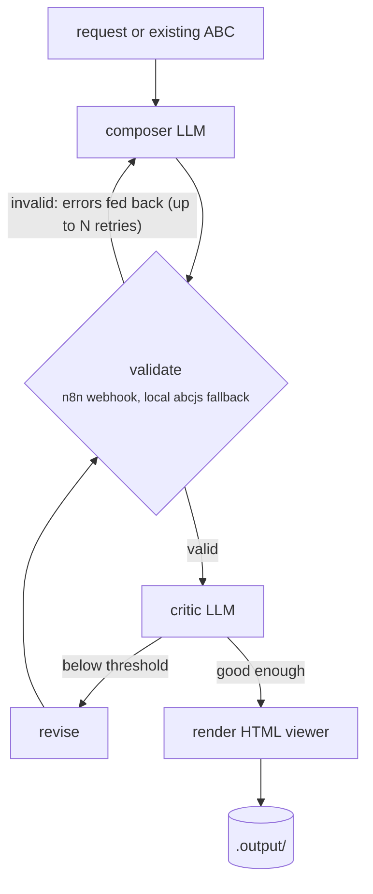

<div align="center">

# pi-music-agent

**Claude Code for sheet music.**

Talk to Pi in plain English. It composes, edits, transposes and converts sheet music,
working in [ABC notation](https://abcnotation.com/) (music as plain text).

[](LICENSE)
[](https://www.typescriptlang.org/)
[](https://nodejs.org/)
[](n8n/README.md)
[](https://www.abcjs.net/)
[](CONTRIBUTING.md)

[Quick start](#quick-start) ·
[Tutorial](#tutorial-from-zero-to-a-finished-score) ·
[How it works](#how-it-works) ·
[Docs](#documentation) ·
[Authors](#authors)

</div>

---

## Highlights

- **Plain-English requests.** "Fill in the gap", "rewrite this in F major", "write a minuet like these".
- **Composer and critic loop.** One model writes, a validator checks the notation, a second model critiques, and the piece is revised until it passes the score threshold.
- **Gap-filling that leaves the rest alone.** A guard compares every bar outside the gap with the original and rejects any edit that touches them.
- **Exact transposition.** Deterministic and aware of the key signature (F# in G major becomes C# in D major). No LLM involved.
- **Score analysis for free.** Key, meter, bar count, voices, gaps, and whether the piece ends on the tonic, all computed instantly with no model call.
- **From scan to notation.** PDFs, images and MusicXML are converted through n8n (OMR), with local Audiveris + music21 as a fallback.
- **A viewer you can play.** Composed and edited pieces come with an HTML page: play the music, download MIDI, print to PDF, download the `.abc`.
- **Open models by default.** Kimi K2.6 via OpenRouter, or fully offline with Ollama.

```text
you ─► Pi (the agent) ─► sheetmusic_* tools ─► pi-music-agent CLI ─► LLM + validator + renderer
       "fill in the gap      compose · edit ·                        composer ⇄ critic loop,
        in this piece"       analyze · transpose · convert           abcjs + n8n
```

> [!NOTE]
> The music agent is a **tool, not code Pi edits**. For music tasks Pi only calls the CLI and never touches this repo's source.

## Quick start

**You need:** Node.js 18 or newer, an [OpenRouter](https://openrouter.ai/) key (or a local [Ollama](https://ollama.com/)), and optionally [n8n](https://n8n.io/). Validation and conversion fall back to local tools when n8n is not running.

```bash
git clone https://github.com/Finnduas/pi-music-agent && cd pi-music-agent
npm install
cp config.example.yaml config.yaml        # default: Kimi K2.6 (open weights) via OpenRouter
export OPENROUTER_API_KEY=sk-or-...       # or put it in config.yaml (git-ignored)
npm run build
npm run smoke                             # offline self-test, no key needed
```

### Hook it into Pi

```bash
mkdir -p ~/.pi/agent/extensions ~/.pi/agent/skills/sheet-music/references
cp pi-integration/sheet-music.ts ~/.pi/agent/extensions/
cp pi-integration/skills/sheet-music/SKILL.md ~/.pi/agent/skills/sheet-music/
cp pi-integration/skills/sheet-music/references/* ~/.pi/agent/skills/sheet-music/references/
```

Start `pi` (or run `/reload` in a running session) and type `/music` to check that it found the agent.
If your checkout is not at `~/pi-music-agent`, set `MUSIC_AGENT_DIR` to its path.
More in [pi-integration/README.md](pi-integration/README.md).

## Tutorial: from zero to a finished score

The repo ships with three public-domain demo pieces in [`examples/input/`](examples/input/).
This tutorial uses them. Every step shows what to say to Pi and the equivalent CLI command.

### 1. Ask what you are looking at

> **You:** What key is examples/input/minuet-with-gap.abc in?

Pi calls `sheetmusic_analyze`. This step is deterministic, so it is instant and costs nothing.

```bash
node dist/cli.js analyze examples/input/minuet-with-gap.abc
```

```text
- bars: 13 (approximate)
- meter: 3/4
- key: G (tonic G)
- voices: 1 (default)
- ends on tonic: yes
- candidate gaps (rest-only / "GAP" bars): bars 5-6
```

The analyzer has already found the problem: bars 5 and 6 are empty.

### 2. Fill in the gap

> **You:** Fill in the gap in that piece.

Pi passes the bar numbers from the analysis to `sheetmusic_edit`. The composer writes only bars 5-6,
the validator checks the notation, the critic judges whether the new bars fit the surrounding phrase,
and the guard rejects any attempt to change the other bars. If the model drifts, it is asked again with
the exact list of bars it changed.

```bash
node dist/cli.js edit examples/input/minuet-with-gap.abc "fill in the gap"
```

You get `.output/minuet-with-a-gap-<id>.abc` and a matching `.html` viewer. Open it in a browser and press **Play**.

### 3. Move it to another key

> **You:** Now rewrite the ode to joy in F major.

Pi analyzes the piece (C major), works out the shortest shift (C to F is +5 semitones) and calls
`sheetmusic_transpose`. No model touches the notes: the transposition is exact, re-spells accidentals
for the new key, rewrites `K:` and inline `[K:]` changes, and transposes chord symbols like `"Am7/G"`.

```bash
node dist/cli.js transpose 5 examples/input/ode-to-joy.abc
```

### 4. Compose something new in the same style

> **You:** Write me a short minuet based on the pieces in the input folder.

Pi passes the folder to `sheetmusic_compose` as style references. The composer is told to imitate them, not copy them.

```bash
node dist/cli.js compose "a short minuet in G major" --refs examples/input --style classical
```

While it runs you can watch the loop work:

```text
  Composing initial sketch...
  Valid (initial).
  Critique pass 1/3...
  Score: 6/10 - Pleasant, but the second phrase does not cadence.
  Revising based on critic feedback...
  Valid (revision).
  Critique pass 2/3...
  Score: 8/10 - Clear binary form with a convincing perfect cadence.
  Score meets threshold (8); stopping early.
```

A revision is never allowed to make things worse: if a later version scores lower, the best one is kept.

### 5. Start from a scan

> **You:** Turn .input/score.pdf into notation.

`sheetmusic_convert` sends the file to the n8n OMR workflow (or runs Audiveris + music21 locally),
validates the result, and saves an `.abc` file you can analyze, edit or transpose like any other.

```bash
node dist/cli.js convert .input/score.pdf
```

### 6. Listen, print, share

Every composed or edited piece gets a self-contained viewer:

| Button | What it does |
|---|---|
| **Play** | plays the score in the browser (piano samples load on first play) |
| **Download MIDI** | for your DAW or notation program |
| **Print / Save PDF** | clean print layout, controls hidden |
| **Show ABC / Download .abc** | the source, ready for the next edit |

The score is always drawn black on white, even in dark mode. Details are in [Viewing and playing ABC files](docs/USAGE.md#viewing-and-playing-abc-files).

### 7. Automate it

- **Drop-folder workflow.** Import the n8n **inbox** workflow, then drop a file into `.input/`. Scans are converted, gaps are filled and a viewer is rendered without you typing anything.
- **HTTP API.** `node dist/cli.js serve` starts a local API on `127.0.0.1:7878` with `/compose`, `/edit`, `/analyze`, `/transpose` and `/convert`. It is sandboxed to the project folder.
- **Pi slash commands.** `/compose`, `/music-edit`, `/music-analyze`, `/music-transpose`, `/music-convert` and `/music-list` work without going through the model.

<details>
<summary><b>Run fully local with Ollama</b></summary>

```bash
ollama pull qwen2.5:14b
```

Then, in `config.yaml`:

```yaml
roles:
  composer: { provider: ollama, model: "qwen2.5:14b", temperature: 0.9 }
  critic:   { provider: ollama, model: "qwen2.5:14b", temperature: 0.2 }
```

Any OpenAI-compatible server works: add it under `providers:` with its `baseUrl`.
See [docs/USAGE.md](docs/USAGE.md#local--fully-offline-ollama).
</details>

<details>
<summary><b>Tuning the loop</b></summary>

```yaml
loop:
  maxValidationRetries: 5    # how often validation errors are fed back to the composer
  maxIterations: 3           # compose / critique / revise cycles
  scoreThreshold: 8          # critic score (0-10) that ends the loop early
```

Kimi K2.6 is a thinking model. The default config sets `reasoning: { enabled: false }` so it does not use
its whole token budget thinking. Remove that and raise `maxTokens` if you want slower, more deliberate output.
</details>

## How it works



For gap-fills, the critic is told to judge only the new bars, and every revision passes through the
gap guard before it is accepted. A step-by-step walkthrough is in [ARCHITECTURE.md](docs/ARCHITECTURE.md).

### n8n

[`n8n/`](n8n/) contains four importable workflows:

| Workflow | Purpose |
|---|---|
| **Inbox** | watches `.input/`: converts scans, fills gaps, renders a viewer |
| **Compose webhook** | `POST` a request, get a piece back |
| **Validation** | the ABC validation service used by the loop |
| **OMR conversion** | scanned sheet music to ABC |

n8n is the primary backend for validation and conversion. When it is unreachable, the agent falls back
to local abcjs and Audiveris and records that in the result's warnings. Setup and checks: [n8n/README.md](n8n/README.md).

## Commands

Day to day you only need two commands. The rest are used by Pi and n8n, and are documented in [USAGE.md](docs/USAGE.md#command-reference).

| Command | Does | Uses an LLM |
|---|---|:---:|
| `compose "<request>"` | write a new piece (`--style`, `--title`, `--refs <folder>`) | yes |
| `edit <file> "<instruction>"` | change a piece, e.g. fill a gap | yes |
| `analyze`, `transpose`, `convert`, `validate`, `render`, `list`, `config`, `serve` | tooling used by Pi and n8n | no |

## Project layout

| Path | Purpose |
|---|---|
| `.input/` | drop source sheet music here (ABC, MusicXML, PDF, image) |
| `.output/` | results land here (`.abc`, `.html`, `.json` records) |
| `src/` | the music agent in TypeScript, see [ARCHITECTURE](docs/ARCHITECTURE.md) |
| `prompts/` | composer and critic system prompts |
| `pi-integration/` | Pi extension and skill |
| `examples/` | public-domain demo inputs and sample outputs |
| `n8n/` | importable n8n workflows |
| `scripts/` | n8n generator, offline smoke tests, live checks |
| `docs/` | architecture, usage reference, presentation |

## Documentation

| Doc | Contents |
|---|---|
| [ARCHITECTURE.md](docs/ARCHITECTURE.md) | modules, tools, n8n, and a walkthrough of "fill in the gap" |
| [USAGE.md](docs/USAGE.md) | every command, the HTTP API, configuration, storage |
| [n8n/README.md](n8n/README.md) | the n8n workflows: setup, use, checks |
| [pi-integration/README.md](pi-integration/README.md) | installing the Pi extension and skill |
| [PRESENTATION.md](docs/PRESENTATION.md) | talk outline and live-demo script |
| [examples/README.md](examples/README.md) | the demo files |

## Development

```bash
npm run typecheck && npm run smoke      # must stay green (offline, no API key)
```

The smoke tests use fake LLM roles and a mock validation webhook, so you can contribute without an API key.
They cover transposition (against an independent reference implementation), rendering, conversion,
the compose loop, the gap guard, the n8n backend and the HTTP server. See [CONTRIBUTING.md](CONTRIBUTING.md).

## Authors

Created by the awesome coders **Mika Alber** and **Elmo Thalemann**.

## License

[GPL-3.0-or-later](LICENSE). Copyright (C) 2026 [Finnduas](https://github.com/Finnduas).
