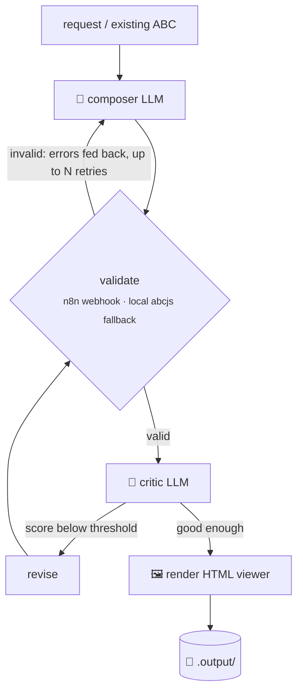

<div align="center">

# 🎼 pi-music-agent

### Claude Code for sheet music

Talk to **Pi** in plain English. It composes, edits, transposes and converts sheet music for you, all in **ABC notation** (music as plain text).

[](LICENSE)
[](https://www.typescriptlang.org/)
[](https://nodejs.org/)
[](n8n/README.md)
[](https://www.abcjs.net/)
[](CONTRIBUTING.md)

[Quick start](#-quick-start) •
[What you can say](#-what-you-can-say-to-pi) •
[How it works](#-how-it-works) •
[Docs](#-documentation) •
[Authors](#-authors)

</div>

---

## ✨ Highlights

- 🗣️ **Plain-English requests:** "fill in the gap", "rewrite this in F major", "write a minuet like these".
- 🔁 **Composer ⇄ critic loop:** an LLM writes, a validator checks the syntax, a second LLM critiques, and the piece gets revised until it's good enough.
- 🎯 **Exact transposition:** done deterministically, no LLM guessing.
- 🧩 **Surgical gap-filling:** only the missing bars change. Everything else stays note-for-note identical.
- 📄 **Scan → notation:** PDFs and images are converted via n8n (OMR), with local Audiveris as a fallback.
- 🎧 **Viewer included:** every result comes with an HTML viewer you can **play**, **print to PDF**, or download as **MIDI**/**ABC**.
- 🔓 **Open models by default:** Kimi K2.6 via OpenRouter, or run fully offline with Ollama.

```text
you ─► Pi (the agent) ─► sheetmusic_* tools ─► pi-music-agent CLI ─► LLM + validator + renderer
       "fill in the gap      compose · edit ·                        composer ⇄ critic loop,
        in this piece"       transpose · convert                     abcjs + n8n
```

> [!NOTE]
> The music agent is a **tool, not code Pi edits**. For music tasks Pi only calls the CLI and never touches this repo's source.

## 💬 What you can say to Pi

| You say | What happens |
|---|---|
| *"Write me a minuet based on the work in the input folder"* | `sheetmusic_compose` uses `.input/` as style references |
| *"Fill in the gap in this piece"* | `sheetmusic_analyze` finds the gap, then `sheetmusic_edit` fills **only** those bars |
| *"Rewrite this in F major"* | Pi works out the semitone shift, then `sheetmusic_transpose` applies it (deterministic, no LLM) |
| *"Turn .input/score.pdf into notation"* | `sheetmusic_convert` (OMR via n8n, local Audiveris as fallback) |

Results land in **`.output/`** as `.abc` plus an `.html` viewer. Open the viewer in any browser to **▶ Play**, **Download MIDI**, **Print / Save PDF**, or **Download .abc**.
See [Viewing and playing ABC files](docs/USAGE.md#viewing-and-playing-abc-files).

## 🚀 Quick start

**Requirements:** Node.js ≥ 18, an [OpenRouter](https://openrouter.ai/) key (or a local [Ollama](https://ollama.com/)), and [n8n](https://n8n.io/) for validation and conversion (local fallbacks are built in).

```bash
git clone https://github.com/Finnduas/pi-music-agent && cd pi-music-agent
npm install
cp config.example.yaml config.yaml        # default: Kimi K2.6 (open weights) via OpenRouter
export OPENROUTER_API_KEY=sk-or-...       # or put it in config.yaml (git-ignored)
npm run build

npm run smoke                             # offline self-test, no key needed ✅
```

Try it without Pi:

```bash
node dist/cli.js edit examples/input/minuet-with-gap.abc "fill in the gap"
node dist/cli.js compose "a wistful baroque minuet in D minor" --style baroque
```

Then open the `.html` file in `.output/` to see, hear and print the score.

### 🔌 Hook it into Pi

```bash
mkdir -p ~/.pi/agent/extensions ~/.pi/agent/skills/sheet-music/references
cp pi-integration/sheet-music.ts ~/.pi/agent/extensions/
cp pi-integration/skills/sheet-music/SKILL.md ~/.pi/agent/skills/sheet-music/
cp pi-integration/skills/sheet-music/references/* ~/.pi/agent/skills/sheet-music/references/
```

Start `pi` (or run `/reload`) and type `/music`. Details are in [pi-integration/README.md](pi-integration/README.md).

<details>
<summary><b>🏠 Run fully local with Ollama</b></summary>

```bash
ollama pull qwen2.5:14b
```

Then, in `config.yaml`:

```yaml
roles:
  composer: { provider: ollama, model: "qwen2.5:14b", temperature: 0.9 }
  critic:   { provider: ollama, model: "qwen2.5:14b", temperature: 0.2 }
```

See [docs/USAGE.md](docs/USAGE.md#local--fully-offline-ollama) for more.
</details>

## 🛠️ Commands

You only need two. Everything else (`analyze`, `transpose`, `convert`, `validate`, `render`, `list`, `config`, `serve`) is used internally by the agent.

| Command | Does | LLM? |
|---|---|:---:|
| `compose "<request>"` | write a new piece (`--style`, `--refs <folder>`) | ✅ |
| `edit <file> "<instruction>"` | change a piece, e.g. fill a gap | ✅ |

Full reference: [docs/USAGE.md](docs/USAGE.md#command-reference).

## 🔧 How it works



Retry counts, iteration limits and the critic's score threshold are set in [`config.yaml`](config.example.yaml) under `loop:`.

### n8n (required)

[`n8n/`](n8n/) contains four importable workflows:

| Workflow | Purpose |
|---|---|
| **Inbox** | drop a file in `.input/`: scans are converted, gaps filled, a viewer rendered |
| **Compose webhook** | `POST` a request, get a piece back |
| **Validation** | ABC syntax validation service used by the loop |
| **OMR conversion** | scanned sheet music → ABC |

n8n is the primary backend for validation and conversion. The local abcjs validator and Audiveris converter are used as fallbacks. Setup and tests: [n8n/README.md](n8n/README.md).

## 📁 Project layout

| Path | Purpose |
|---|---|
| `.input/` | drop source sheet music here (ABC, MusicXML, PDF, image) |
| `.output/` | rendered pieces land here |
| `src/` | the music agent (TypeScript). See [ARCHITECTURE](docs/ARCHITECTURE.md) |
| `prompts/` | composer and critic system prompts |
| `pi-integration/` | Pi extension + skill |
| `examples/` | public-domain demo inputs and sample outputs |
| `n8n/` | importable n8n workflows and how to run them |
| `scripts/` | n8n generator, offline smoke tests, live checks |
| `docs/` | architecture, usage reference, presentation |

## 📚 Documentation

| Doc | What's inside |
|---|---|
| [ARCHITECTURE.md](docs/ARCHITECTURE.md) | modules, tools, n8n, and a step-by-step walkthrough of "fill in the gap" |
| [USAGE.md](docs/USAGE.md) | every command, the HTTP API, configuration, storage |
| [n8n/README.md](n8n/README.md) | the n8n workflows: setup, use, checks |
| [PRESENTATION.md](docs/PRESENTATION.md) | talk outline and live-demo script |
| [examples/README.md](examples/README.md) | demo files |

## 🧪 Development

```bash
npm run typecheck && npm run smoke      # must stay green (offline, no API key)
```

The smoke tests inject fake LLM roles and a mock validation webhook, so you don't need an API key to contribute. See [CONTRIBUTING.md](CONTRIBUTING.md).

## 👥 Authors

Created with ❤️ by the awesome coders **Mika Alber** and **Elmo Thalemann**.

## 📄 License

[GPL-3.0-or-later](LICENSE). Copyright © 2026 [Finnduas](https://github.com/Finnduas).

<div align="center">
<sub>🎵 Made for people who'd rather say "make it in D minor" than count accidentals. 🎵</sub>
</div>
