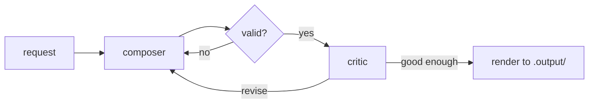

<div align="center">

# pi-music-agent

**Claude Code for sheet music.**

[](LICENSE)
[](https://www.typescriptlang.org/)
[](https://nodejs.org/)

</div>

Ask Pi in plain English to compose, edit, transpose or convert sheet music.
Pi calls this tool, which works in [ABC notation](https://abcnotation.com/) and returns a score you can view, play and print.

## Features

- **Compose** new pieces, optionally in the style of reference files.
- **Edit** existing pieces, e.g. fill in missing bars. Bars outside the gap are guaranteed unchanged.
- **Transpose** exactly, with correct key signatures and spelling. No LLM involved.
- **Analyze** key, meter, bars and gaps instantly.
- **Convert** PDFs, images and MusicXML to ABC (via n8n, or Audiveris locally).
- **View** results in a browser: play, download MIDI, print to PDF.

Every generated piece goes through a loop: a composer model writes it, a validator checks the notation,
and a critic model scores it and asks for revisions until it is good enough.

## Quick start

Requires Node.js 18+ and an [OpenRouter](https://openrouter.ai/) API key (or a local [Ollama](https://ollama.com/)).

```bash
git clone https://github.com/Finnduas/pi-music-agent && cd pi-music-agent
npm install
cp config.example.yaml config.yaml
export OPENROUTER_API_KEY=sk-or-...
npm run build
npm run smoke        # offline self-test, no key needed
```

To use it from Pi, install the extension and skill:

```bash
mkdir -p ~/.pi/agent/extensions ~/.pi/agent/skills/sheet-music/references
cp pi-integration/sheet-music.ts ~/.pi/agent/extensions/
cp pi-integration/skills/sheet-music/SKILL.md ~/.pi/agent/skills/sheet-music/
cp pi-integration/skills/sheet-music/references/* ~/.pi/agent/skills/sheet-music/references/
```

Then start `pi` and type `/music` to check the setup. See [pi-integration/README.md](pi-integration/README.md).

## Tutorial

These steps use the demo pieces in [`examples/input/`](examples/input/). Say the first line to Pi, or run the command yourself.

**1. Find the gap.** *"What's missing in minuet-with-gap.abc?"*

```bash
node dist/cli.js analyze examples/input/minuet-with-gap.abc
# key: G, meter: 3/4, candidate gaps: bars 5-6
```

**2. Fill it.** *"Fill in the gap."* Only bars 5-6 are written; the rest of the piece is checked to be unchanged.

```bash
node dist/cli.js edit examples/input/minuet-with-gap.abc "fill in the gap"
```

**3. Change the key.** *"Rewrite Ode to Joy in F major."* Pi works out the shift (C to F is +5) and transposes exactly.

```bash
node dist/cli.js transpose 5 examples/input/ode-to-joy.abc
```

**4. Compose.** *"Write a short minuet in the style of the input folder."*

```bash
node dist/cli.js compose "a short minuet in G major" --refs examples/input
```

Results are saved to `.output/`. Open the `.html` file in a browser to see and play the score.

## How it works



Validation and conversion run through [n8n workflows](n8n/README.md), with local fallbacks when n8n is not running.
Retry limits and the score threshold are set in `config.yaml`.

## Documentation

- [Usage](docs/USAGE.md): all commands, configuration, HTTP API, running offline with Ollama
- [Architecture](docs/ARCHITECTURE.md): how the modules fit together
- [n8n](n8n/README.md): workflow setup
- [Examples](examples/README.md): demo files

## Development

```bash
npm run typecheck && npm run smoke
```

The tests run offline with mocked models. See [CONTRIBUTING.md](CONTRIBUTING.md).

## Authors

Created by the awesome coders **Mika Alber** and **Elmo Thalemann**.

## License

[GPL-3.0-or-later](LICENSE)
